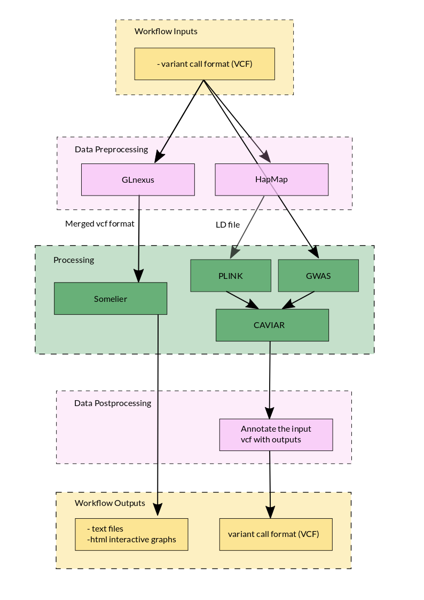

# mixed-sample-graphs

## What's the problem?
The objective of this project is to take annotated variants from mixed tissue samples and determine if they are associated with population stratification or are tumor specific.

## Why should we solved it?

## Workflow Diagram

## How to use ?
This pipeline is conceived to be used with the data generated with the pipeline described at [expressed-variant-impact](https://github.com/collaborativebioinformatics/expressed-variant-impact). The output data can then be used with the [viravate2](https://github.com/collaborativebioinformatics/viravate2) and 

### Dependencies
* [GLnexus](https://github.com/dnanexus-rnd/GLnexus)
* [PLINK](http://zzz.bwh.harvard.edu/plink/)
* [somalier 0.2.12](https://github.com/brentp/somalier)
* [CAVIAR](http://genetics.cs.ucla.edu/caviar/manual.html)

### Installation

### Inputs
Input data format is CVF format as it is the standard format for storing variation data (ref), because it is unambiguous, scalable and flexible.
For the `Somalier` analysis, the site file used in this example can be find here: [sites.hg38.rna.vcf.gz](https://github.com/brentp/somalier/files/4566475/sites.hg38.rna.vcf.gz).
* Data from [expressed-variant-impact](https://github.com/collaborativebioinformatics/expressed-variant-impact):
  * variant vcf files (fully annotated variant calls from HaplotypeCaller)
  * `cancer.vcf` and `cancer.tab` (a set of prioritized cancer-relevant variants detected in the sample)
* Data from [viravate2](https://github.com/collaborativebioinformatics/viravate2):
  * "A large table with DE results and associated variants. This would include things like gene names, logFC values, significance values, and then the variant information."

### Outputs
* Data for [expressed-variant-reporting](https://github.com/collaborativebioinformatics/expressed-variant-reporting):
  * See [inputs docs](https://docs.google.com/spreadsheets/d/1pcB_bI_83B__sJ_Qw3tYDUhAYTz7Bh9SBvxjMzd8L4U/edit#gid=0)
* Data for [viravate2](https://github.com/collaborativebioinformatics/viravate2):
  * VCF file containig variants associated with population stratification or tumors

### Validation dataset
**Somalier:**
The tool does not seem to resolve the ancestry and relatedness, but that is not surprising, because the genome sketch is based on the 1000 genomes project.
A possible resolution could be achieved by using a genome sketch based on cell lines. So finding the normal samples and using the instructions from the somalier github to generate the sketches as well as a set of labels for the cells associated with each sketch.
There are data sets that can be used to generate these genome sketches (https://www.ebi.ac.uk/ega/studies/EGAS00001000610 and https://www.nature.com/articles/nbt.3080 - not sure if this one contains our cells). 
Or, another option to test this method is to use another data set that would align to the 1000 genomes genome sketch.  I looked around but did not want to use any controlled data sets for this project because we are putting it out on github.  One intriguing option was to test the tool using files from the Personal Genome Project, but that would not be disease-related.

## References
@pedersenSomalierRapidRelatedness2020

## People/Team
James Baye  
Alan Cleary  
Virginie Grosboillot  
Sam Hokin  
Adelaide Rhodes  
Chaitanya Srinivasan  
