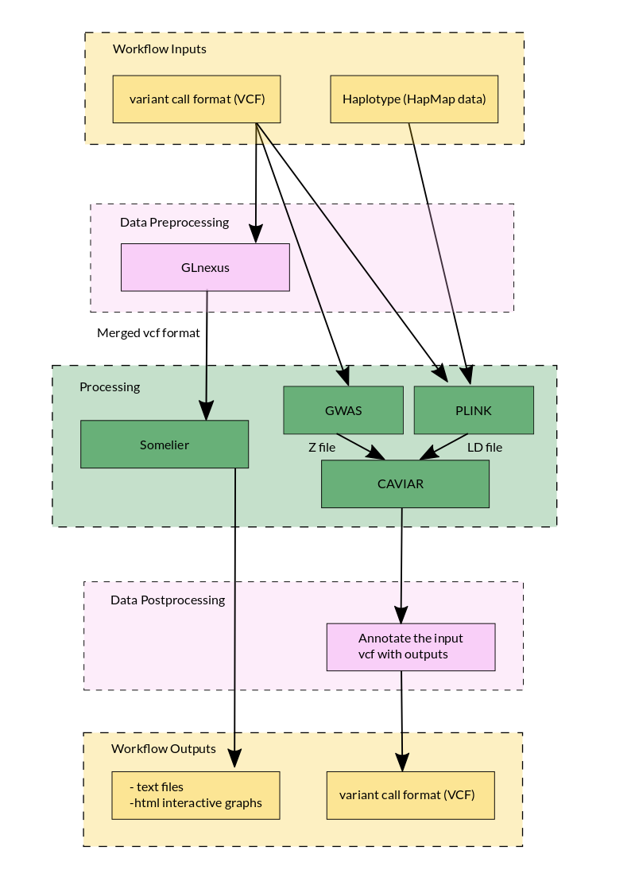
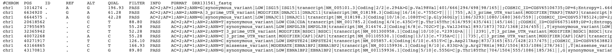

# DSVifier

## What's the problem?
Mixed tissue samples contain a variety of variants.
While many of these variants are legitimate biological signal, not all variants should necessarily be implicated in the diease of interest.
The objective of this project is to take annotated variants from mixed tissue samples and identify variants that are likely associated with the disease being studied while accounting for confounding effects, such as population stratification.

## Why should we solve it?
Associating variants with a particular disease enhances our understanding of its genetic provenance.
More practically, variants from mixed samples can guide clinicians during diagnosis and treatment, and aid drug developers in the identification of gene targets.

## Workflow diagram

## How to use?
This pipeline performs two different analyses: one with Somalier and one with CAVIAR.
Both tools consume VCF files output by the [Trinity CTAT pipeline](https://github.com/collaborativebioinformatics/expressed-variant-impact).
The data output by Somalier can be used to extract informative sites, evaluate relatedness of variants, and perform quality-control.
It can also be integrated in clinical reports with the [snpReportR](https://github.com/collaborativebioinformatics/expressed-variant-reporting).
The data output by CAVIAR can be used to evaluate which variants are likely casual and can be used in downstream analyses, such as the [viravate2 pipeline](https://github.com/collaborativebioinformatics/viravate2).

### Dependencies
* [GLnexus](https://github.com/dnanexus-rnd/GLnexus)
* [PLINK](http://zzz.bwh.harvard.edu/plink/)
* [somalier 0.2.12](https://github.com/brentp/somalier)
* [CAVIAR](http://genetics.cs.ucla.edu/caviar/manual.html)
* GWAS pipeline

### Installation
The DSVifier pipeline has not been implemented as a production pipeline, so a turn-key installation is not available.
However, the pipeline is composed of readily available bioinformatic tools/pipelines (see Dependencies).
Each tool's installation process can be found by following the provided links.
Additaionlly, these tools are available on the DNAnexus platform, which we used when developing the pipeline.

A Somalier example is provided as a Jupyter notebook, which depends on DNAnexus and uses the site file [sites.hg38.rna.vcf.gz](https://github.com/brentp/somalier/files/4566475/sites.hg38.rna.vcf.gz).

In the case of CAVIAR, we leave it to users to use a GWAS pipeline that best fits their data/study.

### Inputs
* Both Somalier and CAVIAR require VCF files from the [Trinity CTAT pipeline](https://github.com/collaborativebioinformatics/expressed-variant-impact)
* CAVIAR also requires haplotype information for the population being studied, such as HapMap data from 1000 genomes project

### Outputs
* Somalier
  * HTML files describing various relationships among the input variants
  * TSV files containing the data visualized in the HTML files
* CAVIAR
  * Our pipeline annotates the input VCF files statistics generated from CAVIAR (see the [CAVIAR GitHub](https://github.com/fhormoz/caviar) for a complete list our output files

### Validation dataset
**Somalier:**

The tool does not seem to resolve the ancestry and relatedness, but that is not surprising, because the genome sketch is based on the 1000 genomes project.
A possible resolution could be achieved by using a genome sketch based on cell lines. So finding the normal samples and using the instructions from the somalier github to generate the sketches as well as a set of labels for the cells associated with each sketch.
There are data sets that can be used to generate these genome sketches (https://www.ebi.ac.uk/ega/studies/EGAS00001000610 and https://www.nature.com/articles/nbt.3080 - not sure if this one contains our cells). 
Or, another option to test this method is to use another data set that would align to the 1000 genomes genome sketch.  I looked around but did not want to use any controlled data sets for this project because we are putting it out on github.  One intriguing option was to test the tool using files from the Personal Genome Project, but that would not be disease-related.

## References

## People/Team
James Baye  
Alan Cleary  
Virginie Grosboillot  
Sam Hokin  
Adelaide Rhodes  
Chaitanya Srinivasan  
