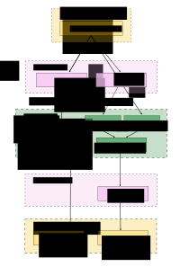

# mixed-sample-graphs

The objective of this project is to take annotated variants from mixed tissue samples and determine if they are associated with population stratification or are tumor specific.

## What's the problem?

## Why should we solved it?

## Workflow Diagram

## How to use ?

### Dependencies
* [GLnexus]https://github.com/dnanexus-rnd/GLnexus
* [somalier](https://github.com/brentp/somalier)
* [MuTect](https://github.com/broadinstitute/mutect)
* [CAVIAR](http://genetics.cs.ucla.edu/caviar/manual.html)
* [PLINK](http://zzz.bwh.harvard.edu/plink/)

### Installation

### Inputs
* Data from [expressed-variant-impact](https://github.com/collaborativebioinformatics/expressed-variant-impact):
  * variant vcf files (fully annotated variant calls from HaplotypeCaller)
  * `cancer.vcf` and `cancer.tab` (a set of prioritized cancer-relevant variants detected in the sample)
* Data from [viravate2](https://github.com/collaborativebioinformatics/viravate2):
  * "A large table with DE results and associated variants. This would include things like gene names, logFC values, significance values, and then the variant information."

### Outputs
* Data for [expressed-variant-reporting](https://github.com/collaborativebioinformatics/expressed-variant-reporting):
  * See [inputs docs](https://docs.google.com/spreadsheets/d/1pcB_bI_83B__sJ_Qw3tYDUhAYTz7Bh9SBvxjMzd8L4U/edit#gid=0)
* Data for [viravate2](https://github.com/collaborativebioinformatics/viravate2):
  * VCF file containig variants associated with population stratification or tumors

  ### Validation dataset

## References

## People/Team
James Baye  
Alan Cleary  
Virginie Grosboillot  
Sam Hokin  
Adelaide Rhodes  
Chaitanya Srinivasan  
